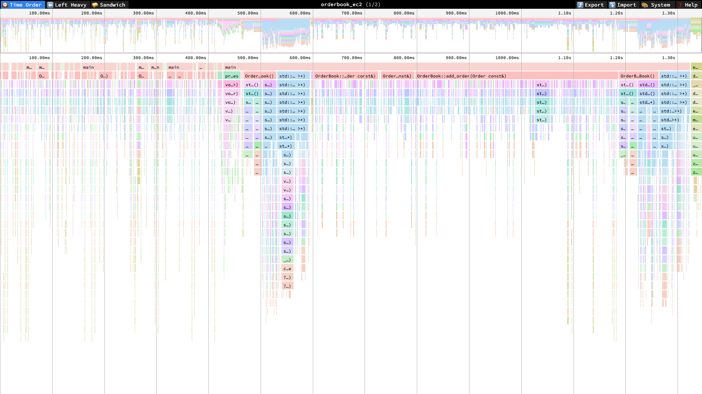

# Low-Latency Order Book Engine

A high-performance C++ order matching engine built for sub-microsecond latency. Implements continuous price-time priority matching with lock-free order ingestion, thread-local memory pools, and automated EC2 Spot benchmarking with P99.9 tail latency profiling.

**A real `perf` flame graph from the EC2 benchmark run:**

<a href="https://www.speedscope.app/#profileURL=https://raw.githubusercontent.com/RyanJHamby/order-book-engine/main/orderbook-engine/profiles/orderbook_ec2.perf_script.txt&title=orderbook_ec2">
  
</a>

[Explore it interactively](https://www.speedscope.app/#profileURL=https://raw.githubusercontent.com/RyanJHamby/order-book-engine/main/orderbook-engine/profiles/orderbook_ec2.perf_script.txt&title=orderbook_ec2) (zoom, search, sandwich view). See [Flame graphs](#flame-graphs) below for what it shows.

## Performance

Benchmarked with 1,000,000 orders (alternating buy/sell, random prices, real matching with 773K fills). Pool allocation + matching in the timed loop.

| Metric | Apple Silicon (local, informal) | EC2 `c6i.large` (Intel Xeon Ice Lake, isolated core, 3 runs) |
|--------|---|---|
| P50 latency | 0.21 us | 0.208–0.214 us |
| P95 latency | 1.5 us | 1.26–1.32 us |
| P99 latency | 2.6 us | 1.95–2.07 us |
| P99.9 latency | 4.7–5.2 us | 3.09–3.23 us |
| Pipeline throughput | 2.5–2.7M orders/sec | 1.42–1.80M orders/sec |

Apple Silicon numbers come from an interactive local dev machine — not a
representative, isolated benchmark environment (no CPU pinning, no turbo/governor
control, shared with everything else running on the laptop). They're useful as a
sanity check while iterating, but the **EC2 numbers are the ones that should be
cited** anywhere these results are referenced (resume, portfolio, etc.):
`cloud_init.sh` pins the benchmark to an isolated core (`taskset -c 1`), disables
turbo boost, and sets the CPU governor to `performance` for reproducibility, none
of which is possible or meaningful on a laptop. EC2 latency percentiles are
consistently *better* than the Apple Silicon numbers (tighter isolation wins out
despite lower single-core clock), but EC2 throughput is consistently *lower*
(1.4–1.8M vs 2.5–2.7M orders/sec) — a `c6i.large` has only 2 vCPUs, and the flame
graph below points at real time in `std::map`'s red-black tree rebalancing inside
`OrderBook::add_order`, not scheduler noise. Ranges reflect 3 separate on-demand
runs (`benchmark_results_*.txt` in the S3 bucket), not a single sample.

`perf stat` hardware counters report `<not supported>` on this instance — a
known limitation of `c6i.large`'s virtualization layer not exposing PMU
counters to the guest, not a script bug.

## Architecture

```
Producer Thread                    Matching Thread
+-----------------+    SPSC     +--------------------+
| ThreadLocalPool | -> Queue -> | OrderBook          |
| (slab alloc)    |            | (price-time match) |
+-----------------+            +--------------------+
                                        |
                                   Fill Reports
```

The system mirrors a real exchange pipeline:

1. **Order ingestion** — Producer threads allocate orders from per-thread slab pools (zero contention, stable pointers) and push them into SPSC lock-free queues.
2. **Matching engine** — A single dedicated thread pops orders from the queue and feeds them to the `OrderBook`. Matching happens inline on `add_order()`: incoming orders cross against resting price levels until filled. No batch step, no locks in the hot path.
3. **Fill reporting** — Each match generates a `Fill` record with buyer/seller IDs, execution price, and quantity.

### Why single-threaded matching?

Lock-free queues eliminate mutex contention at the ingestion boundary. The matching engine itself is single-threaded by design — this avoids synchronization overhead in the critical path and is the standard architecture used by production exchanges (CME Globex, NASDAQ ITCH).

## Key Components

### Matching Engine (`orderbook.hpp`, `orderbook.cpp`)

- **Continuous matching**: Orders match inline in `add_order()`. An aggressive buy sweeps through ask levels lowest-first; an aggressive sell sweeps through bid levels highest-first.
- **Price-time priority**: `std::map<double, std::deque<Order>>` — orders at the same price level are filled FIFO.
- **Partial fills**: Incoming order quantity is decremented against each resting order. Unfilled remainder rests on the book.
- **Order cancellation**: `cancel_order(id)` with O(1) lookup via `unordered_map` index, then removal from the price-level deque.

### SPSC Lock-Free Queue (`order_queue.hpp`)

- Wait-free ring buffer for single-producer, single-consumer use.
- Acquire-release memory ordering: producer acquires consumer's `head`, releases own `tail`; consumer acquires producer's `tail`, releases own `head`.
- `alignas(64)` on head/tail atomics to prevent false sharing across cache lines.
- Usable capacity is N-1 (one sentinel slot for full/empty disambiguation).

### Thread-Local Memory Pool (`memory_pool.hpp`)

- Slab-based allocator: `malloc`s fixed-size slabs of objects. When a slab is exhausted, a new one is allocated. Existing pointers remain valid (no vector-style invalidation).
- `get_thread_local_pool<T>()` returns a `thread_local` instance — each thread gets its own pool with zero contention.
- O(1) bump-pointer allocation within a slab.

### Compiler Flags

```
-O3 -march=native -flto -fno-exceptions -fno-rtti -mavx2
```

- `-flto`: Link-time optimization enables cross-translation-unit inlining of the matching hot path.
- `-fno-exceptions -fno-rtti`: Eliminates exception handling and RTTI overhead. Tests override this (GTest requires exceptions).
- `-mavx2`: Enables AVX2 instruction set on x86_64 targets.

## Building

**Prerequisites:** C++20 compiler, CMake 3.20+, Google Test

```bash
cd orderbook-engine
./scripts/build_and_run_benchmark.sh
```

Or manually:

```bash
mkdir build && cd build
cmake .. -DCMAKE_BUILD_TYPE=Release
make -j$(nproc)
./latency_benchmark
./tests/orderbook_tests
```

## Testing

51 unit tests across 8 test suites:

| Suite | Tests | Coverage |
|-------|-------|----------|
| OrderTest | 3 | Struct creation, type validation |
| OrderBookTest | 11 | Crossing, partial fills, price-time priority, multi-level sweeps, cancellation |
| OrderQueueTest | 5 | Push/pop, capacity, circular wrap |
| MemoryPoolTest | 5 | Slab allocation, stress (2000 allocs) |
| IntegrationTest | 4 | Pool + queue + matching end-to-end |
| PerformanceTest | 5 | Throughput and latency thresholds |
| EdgeCaseTest | 13 | Extreme values, zero qty, cancel semantics |
| ConcurrencyTest | 5 | SPSC producer-consumer, multi-queue fan-in, pipeline |

```bash
./scripts/run_tests.sh
```

### ThreadSanitizer

The concurrency guarantees (`ConcurrencyTest`, the SPSC queue in
`order_queue.hpp`) are validated under ThreadSanitizer:

```bash
./scripts/run_tsan.sh
```

Builds a separate `build-tsan/` tree with `-DENABLE_TSAN=ON` (`-fsanitize=thread
-O1 -g`, no `-march=native`/`-flto`) and runs the full test suite plus the
latency benchmark through it. On macOS, Apple Clang's bundled TSan runtime
crashes at startup on recent OS versions (dyld shared cache format changed);
the script auto-detects and uses Homebrew LLVM (`brew install llvm`) instead
if present. TSan throughput numbers are ~5-10x slower than native and are not
representative — use `scripts/run_benchmark.sh` for real performance numbers.

## EC2 Spot Benchmarking

Automated profiling on `c6i.large` (Intel Xeon Ice Lake) Spot instances:

```bash
# One-time setup: creates VPC, security group, key pair, IAM role.
./scripts/aws_cloud_init.sh

# Launch benchmark. Instance self-terminates; results upload to S3.
./scripts/run_benchmark.sh
```

The cloud-init script:
- Disables turbo boost and sets the CPU governor to `performance` for stable measurements
- Pins the benchmark to a single core via `taskset` to avoid scheduler jitter
- Builds with `-DENABLE_PROFILING=ON` (keeps `-O3`/LTO, adds `-g -fno-omit-frame-pointer` for symbolized profiling)
- Runs `perf stat` for hardware counters (cache misses, IPC, branch mispredicts)
- Runs `perf record -g --call-graph dwarf` for a flame graph, converts to `perf script` text via `perf_script.txt`
- Captures system info (CPU model, AVX2 flags, kernel version)
- Uploads results to S3 with timestamps

Spot instances run at ~70% discount vs. on-demand. The script reports the exact savings percentage.

### Flame graphs

`perf_script_<timestamp>.txt` in the uploaded results is raw `perf script`
output — drag it into [speedscope.app](https://www.speedscope.app/) directly
(no FlameGraph.pl / SVG conversion step needed; speedscope's linux-perf
importer reads it as-is). This only works from the EC2 run: `perf` is
Linux-only, and macOS has no equivalent that produces this format — flame
graphs for this project are EC2-only, not something to attempt locally.

Captured samples land inside `OrderBook::add_order` → `std::map<double,
std::deque<Order>>::operator[]` → `_Rb_tree_insert_and_rebalance` — the
price-level map's red-black tree insertion is real, visible cost, alongside
some `do_anonymous_page` kernel time from first-touch page faults on the
order pool. This is why pipeline throughput (1.4–1.8M orders/sec) trails the
isolated per-op latency numbers: the tree rebalancing cost only shows up
under sustained load, not in a single `add_order` call.

One gotcha worth knowing if you re-run `cloud_init.sh` on a newer/older
Ubuntu 22.04 AMI: `apt`'s `linux-tools-aws` package version and the AMI's
actual booted kernel version can drift (apt tracks the latest kernel in the
repo; a given AMI is pinned to whatever it shipped with). The script
resolves and calls the real `perf` binary directly under
`/usr/lib/linux-tools/<version>/perf` rather than going through the
`perf` wrapper on `PATH`, which refuses to run on any version mismatch even
though the underlying `perf_event` syscall ABI works fine across the gap.

## Project Structure

```
orderbook-engine/
├── include/
│   ├── order.hpp            # Order and Fill structs
│   ├── orderbook.hpp        # Matching engine interface
│   ├── order_queue.hpp      # SPSC lock-free ring buffer
│   └── memory_pool.hpp      # Thread-local slab allocator
├── src/
│   ├── main.cpp             # Demo: pool -> queue -> match pipeline
│   ├── order.cpp            # Order translation unit
│   └── orderbook.cpp        # Matching engine implementation
├── benchmarks/
│   └── latency_test.cpp     # 1M-order benchmark with percentiles
├── tests/                   # 51 Google Test cases (8 suites)
├── scripts/
│   ├── aws_cloud_init.sh    # One-time AWS infrastructure setup
│   ├── run_benchmark.sh     # EC2 Spot instance launcher
│   ├── cloud_init.sh        # EC2 instance bootstrap + benchmark
│   ├── build_and_run_benchmark.sh  # Local build + benchmark
│   └── run_tests.sh         # Unit test runner
└── CMakeLists.txt           # Build configuration
```
